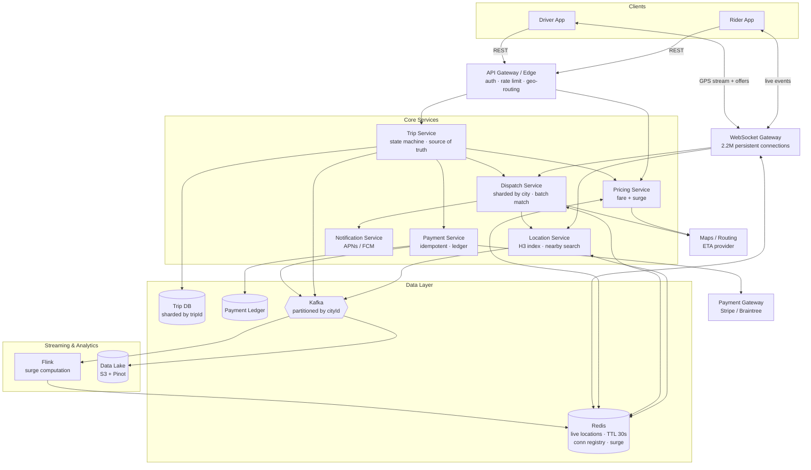

# Uber — High Level Design

> Interview prep notes. Target format: 45-minute HLD round.

---

## 1. Define the System

Uber is a **real-time, two-sided geospatial marketplace**. Riders create demand, drivers supply
capacity, and the system's core job is to match the two within seconds based on physical proximity,
then manage the trip until money moves.

The critical loop:

> Driver goes online → streams GPS → rider requests a ride → system finds nearby drivers → offers
> the trip → driver accepts → live tracking → trip ends → fare charged → both rate each other.

**Actors:** Rider app, Driver app, backend services, payment gateway, maps/routing provider.

**In scope:** driver location ingestion, nearby-driver search, matching/dispatch, trip lifecycle,
fare + surge pricing, payments, live tracking, ratings, trip history.

**Out of scope (state this explicitly in the interview):** Uber Eats, UberPool/carpooling,
scheduled rides, corporate accounts, driver onboarding/background checks, ML model internals for
ETA and fraud.

Key framing point: **this is not a CRUD app.** The hard part is that ~250,000 location writes per
second flow through the system while matching decisions must be strongly consistent, so a driver is
never double-booked.

---

## 2. Functional Requirements

### Driver side
- Go online / offline and set availability.
- Continuously stream location (roughly every 4 seconds).
- Receive a ride offer, accept or decline within a timeout.
- Start the trip (with rider OTP verification) and end the trip.
- View earnings and trip history.

### Rider side
- Enter pickup and destination, see a fare estimate and pickup ETA before committing.
- Request a ride and see search progress.
- Once matched, see driver identity, vehicle, and live position on the map.
- Cancel (with a cancellation fee policy after a grace window).
- Pay automatically on trip completion and rate the driver.
- View past trips and receipts.

### System side
- Maintain a live geospatial index of available drivers.
- Nearby-driver search filtered by product type (UberX, XL, Black).
- Dispatch/matching that assigns exactly one driver per trip.
- Trip state machine as source of truth.
- Dynamic surge pricing per geographic cell.
- Payment authorization and capture, idempotent.
- Push notifications when apps are backgrounded.

### Deliberately deferred
Pooling, multi-stop routes, scheduled rides, driver incentive programs, in-app SOS.

---

## 3. Non-Functional Requirements

### Latency (the headline requirement — this is a physical-world system)
- Location ingestion write: p99 under 100 ms.
- Nearby-driver search: p99 under 200 ms.
- End-to-end match (request → driver assigned): p99 under 2 seconds, target under 1 second.
- Live location push to rider: under 1 second freshness.

### Availability
99.99% for the request/match path. A minute of downtime in a major city is direct revenue loss and
stranded users. Regional failure must not cascade globally.

### Consistency — not uniform across the system (this is where you earn points)
| Path | Model | Reason |
| --- | --- | --- |
| Driver location reads | Eventually consistent (AP) | A location 2s stale is harmless |
| Driver assignment | Strongly consistent (CP) | Double-booking breaks the product |
| Trip state transitions | Linearizable per trip | State must move forward only |
| Payments | Exactly-once via idempotency keys | Double-charging is worse than failing |

### Durability
Trips, fares, and payment ledger entries must never be lost. Location pings are disposable — only
the latest matters for dispatch.

### Scalability
Write-heavy on the ingestion path, read-heavy on the tracking path, scales horizontally per city.

### Security & compliance
PII protection, phone number masking via proxy numbers, PCI-DSS handled by tokenizing card data at
a provider, per-region data residency (GDPR), and graceful degradation — if surge pricing is down,
fall back to base fare rather than refusing rides.

---

## 4. Scale Estimation and Bottleneck Identification

State assumptions first, then derive. Interviewers care about the derivation, not the numbers.

**Assumptions:** 100M monthly active riders · 5M registered drivers · 1M drivers concurrently online
at global peak · 20M rides/day · average trip duration 20 minutes.

### Ride throughput
- 20M ÷ 86,400 ≈ **230 rides/sec average**
- Peak ≈ 3–5× average (Friday evening, rain, event let-out) → **~1,000 rides/sec peak**

### Location ingestion — the dominant load
- 1M online drivers × 1 ping / 4 sec = **250,000 writes/sec**
- Payload ≈ 100 bytes (driverId, lat, lng, heading, speed, accuracy, ts) → 25 MB/sec ≈ **2 TB/day**
- This is ~1,000× the ride request rate. **It shapes the entire architecture.**

### Concurrent connections
- Concurrent trips at peak = 1,000/sec × 1,200 sec = **~1.2M in-flight trips**
- Persistent connections = 1M drivers + 1.2M riders ≈ **2.2M concurrent WebSockets**
- At ~50K connections/gateway node → ~45 nodes minimum; provision a few hundred for headroom

### Storage
- Trip metadata ~1 KB × 20M/day = **20 GB/day** ≈ 7 TB/year — trivial
- GPS breadcrumbs: 20 min ÷ 4 sec = 300 points × ~32 B ≈ 10 KB/trip → **200 GB/day** ≈ 73 TB/year
  (tier to object storage after 90 days)
- Live location state: 1M drivers × ~200 B = **200 MB total**

> Key insight to voice: **the live location dataset is tiny; the challenge is write throughput and
> fan-out, not capacity.** That's why location pings never go into a durable relational database.

### Bottlenecks and mitigations

1. **Location write amplification.** 250K/sec against Postgres would destroy it. Write to an
   in-memory geo-index with a 30-second TTL (stale drivers expire themselves — no cleanup job) and
   asynchronously mirror to Kafka for analytics.
2. **Geographic hotspots.** Downtown Manhattan holds orders of magnitude more drivers than a suburb,
   so uniform sharding produces hot partitions. Shard by geographic cell (H3/S2) and dynamically
   split dense cells rather than using a fixed lat/lng grid.
3. **Matching race conditions.** Two riders requesting simultaneously can be offered the same driver.
   Fix with a single-writer model: consistent-hash each driver to exactly one dispatch shard, and
   hold a short-lived lease on the driver during the offer window.
4. **Connection state.** WebSocket gateways are stateful, so pushing a ride offer requires knowing
   which node holds that driver's socket. Maintain a `driverId → gatewayNode` registry in Redis and
   route via pub/sub.
5. **Payment duplication.** Client retries cause double charges. Idempotency keys plus a
   transactional outbox for payment events.
6. **Thundering herd.** A concert ending sends thousands of requests from one cell at once. Batch
   dispatch into short windows and let surge pricing act as the throttle.
7. **Cross-region latency.** A ride should never span regions. Pin the entire trip to the city's
   regional stack.

---

## 5. API Design

REST over HTTP for request/response, WebSockets for anything real-time. Every mutating endpoint
accepts an `Idempotency-Key` header.

### Driver APIs

```http
POST /v1/drivers/status
  { "status": "ONLINE" | "OFFLINE", "productTypes": ["UBERX"] }

WS   /v1/drivers/location            # client → server, continuous
  { "lat": 12.97, "lng": 77.59, "heading": 145, "speed": 8.3,
    "accuracy": 5, "ts": 1754899200 }

WS   server → driver                 # push
  { "type": "RIDE_OFFER", "offerId": "...", "tripId": "...",
    "pickup": {...}, "dropoff": {...},
    "estimatedFare": 245.00, "expiresInSec": 15 }

POST /v1/offers/{offerId}/accept
POST /v1/offers/{offerId}/decline
POST /v1/trips/{tripId}/start        { "otp": "4821" }
POST /v1/trips/{tripId}/complete     { "endLat":..., "endLng":...,
                                       "distanceMeters":..., "durationSec":... }
```

### Rider APIs

```http
POST /v1/fare-estimates
  { "pickup": {...}, "dropoff": {...}, "productType": "UBERX" }
  → { "estimateId": "...", "fareLow": 220, "fareHigh": 265,
      "surgeMultiplier": 1.4, "pickupEtaSec": 240 }

POST /v1/trips
  { "estimateId": "...", "paymentMethodId": "..." }
  → { "tripId": "...", "status": "SEARCHING" }

GET  /v1/trips/{tripId}
WS   /v1/trips/{tripId}/events       # push stream
  # TRIP_MATCHED | DRIVER_LOCATION | DRIVER_ARRIVED
  # | TRIP_STARTED | TRIP_COMPLETED | NO_DRIVERS_FOUND

POST /v1/trips/{tripId}/cancel       { "reason": "CHANGED_MIND" }
POST /v1/trips/{tripId}/rating       { "stars": 5, "comment": "..." }
GET  /v1/trips?cursor=<opaque>&limit=20
```

### Internal service APIs

```http
POST /internal/geo/nearby
  { "lat":..., "lng":..., "radiusMeters": 3000,
    "productType": "UBERX", "limit": 20 }
  → [ { "driverId":..., "distanceMeters":..., "etaSec":... } ]

POST /internal/pricing/quote
POST /internal/payments/authorize    # at trip start
POST /internal/payments/capture      # at trip end
```

### Trip state machine — the contract the whole system agrees on

```
REQUESTED → SEARCHING → MATCHED → ARRIVING → ARRIVED
          → IN_PROGRESS → COMPLETED → PAID

Terminal branches: NO_DRIVERS_FOUND, CANCELLED_BY_RIDER,
                   CANCELLED_BY_DRIVER, PAYMENT_FAILED
```

Transitions are validated server-side and are strictly forward-only, which makes retries safe and
gives a natural audit log.

---

## 6. Strategic Technology and Infrastructure Decisions

**Geospatial index: H3 hexagons over geohash.** Geohash uses rectangles, so neighbor distance is
inconsistent and boundary cases are ugly — two points meters apart can sit in different top-level
cells. H3 (built and open-sourced by Uber) uses hexagons where every neighbor's center is
equidistant, so an expanding `kRing` search is clean and correct. It also gives natural buckets for
aggregating surge demand. QuadTree is the alternative worth naming since it adapts to density, but
it is costlier to rebalance under 250K writes/sec.

**Location store: Redis, not a database.** Sorted sets keyed by H3 cell, with a 30-second TTL per
driver entry. Expiry doubles as offline detection. Chosen because the dataset is ~200 MB, the access
pattern is write-heavy point updates, and durability genuinely doesn't matter — a lost ping is
replaced 4 seconds later.

**Kafka as the backbone.** Location pings, trip events, and payment events publish to Kafka
partitioned by `cityId`. Decouples the real-time path from analytics, gives replay for debugging,
and feeds the streaming jobs.

**Dispatch service: sharded by city, batched matching.** Rather than greedily assigning the first
request to the closest driver, accumulate requests over a 1–2 second window and solve the assignment
as a batch (Hungarian algorithm or a greedy ETA heuristic). This measurably reduces global wait time
versus first-come-first-served — occasionally one rider waits marginally longer so two others get
matched much faster. Each city is an independent shard, so dispatch state lives in memory and a city
outage is contained.

**Trip store: partitioned by `tripId` with strong consistency.** Options: DynamoDB with conditional
writes, Cassandra with lightweight transactions, or Spanner. Uber's own answer was Schemaless, an
append-only sharded layer over MySQL. Whatever the choice, pair it with the **transactional outbox
pattern** so trip state changes and their emitted events commit atomically.

**Surge pricing via stream processing.** A Flink or Kafka Streams job computes the demand-to-supply
ratio per H3 cell over a sliding window and publishes multipliers to Redis. The pricing service
reads from cache, so a failure in the streaming job degrades to base pricing rather than blocking
rides.

**Payments as an isolated service with a double-entry ledger.** Authorize at trip start, capture at
completion, retry asynchronously with a dead-letter queue. Card data never touches your servers —
tokenize through Stripe or Braintree to keep PCI scope minimal.

**Connection layer: dedicated stateful WebSocket gateways** (Go or Node), separate from stateless
business services so they scale and deploy independently. Fall back to APNs/FCM push when the app is
backgrounded.

**Maps and ETA:** start with a third-party provider (Google Maps/Mapbox), cache route results by
`(originCell, destCell, timeBucket)`, and plan to move in-house at scale since routing API costs
become a top-three line item.

**Deployment topology:** region per geography, availability zones within, and **city as the logical
shard key**. This is the most important infrastructure decision — a bad deploy or overload in one
city is blast-radius-contained, and it satisfies data residency law.

**Observability:** distributed tracing is non-negotiable when a single ride request touches eight
services. Jaeger, also originally built at Uber, exists precisely because of this problem.

---

## 7. High Level Design Diagram



### The two paths to trace when presenting

**Ingestion (high volume, eventually consistent):** Driver app → WebSocket gateway → Location
Service → Redis H3 index, with an async fork to Kafka. Nothing durable, nothing blocking.

**Matching (low volume, strongly consistent):** Rider request → Trip Service creates the trip in
`SEARCHING` → Dispatch queries Location Service for candidates → leases a driver in Redis → pushes
the offer through the gateway → on accept, Trip Service transitions to `MATCHED` and emits an event
that streams live driver position to the rider.

---

## Likely Follow-up Deep Dives

- **How the geospatial index actually works** — H3 cell resolution choice and expanding ring search.
- **Preventing driver double-booking** — lease/lock semantics under concurrent dispatch.
- **Surge pricing correctness** — windowing, and why stale surge is acceptable but wrong fare is not.
- **Payment exactly-once** — idempotency keys, outbox, reconciliation.
